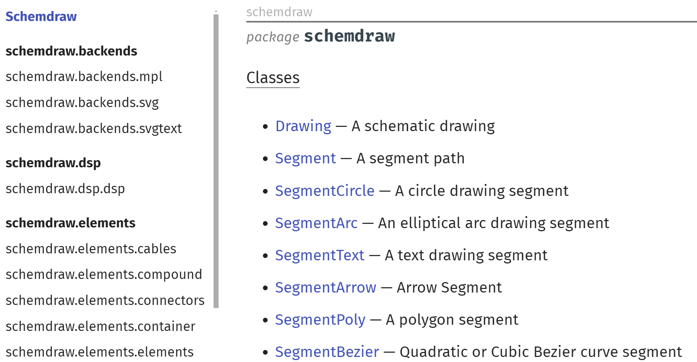
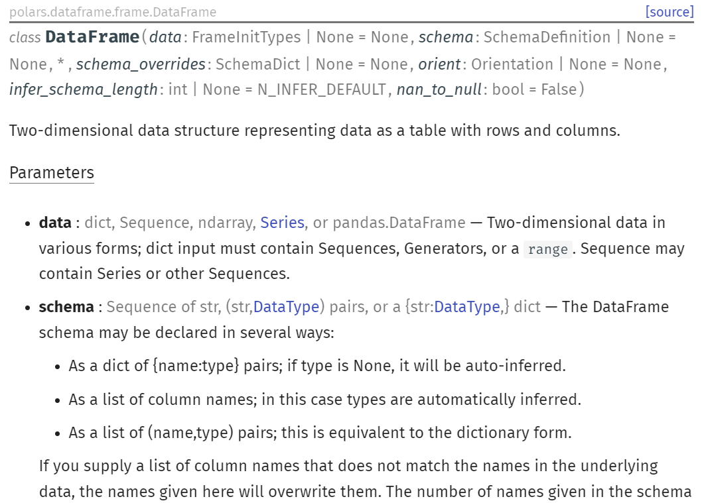
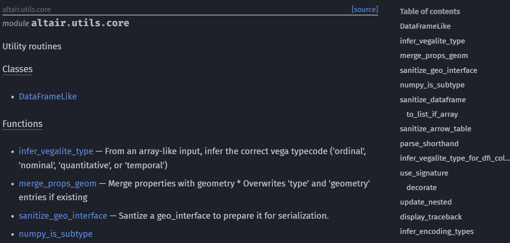

# MkAPI

[![PyPI Version][pypi-v-image]][pypi-v-link]
[![Python Version][python-v-image]][python-v-link]
[![Build Status][GHAction-image]][GHAction-link]
[![Coverage Status][codecov-image]][codecov-link]

MkAPI is a plugin for [MkDocs](https://www.mkdocs.org/) to generate
API documentation for your Python project.

MkAPI supports two styles of docstrings:
[Google](http://google.github.io/styleguide/pyguide.html#38-comments-and-docstrings)
and
[NumPy](https://numpydoc.readthedocs.io/en/latest/format.html#docstring-standard).
See [Napoleon](https://sphinxcontrib-napoleon.readthedocs.io/en/latest/)
documentation for details.

## Screenshots







## Features

* **Type annotation**: If you write your function such as
  `def func(x: int) -> str:`, you don't need write type(s)
  in Parameters, Returns, or Yields section again.
  You can override the type annotation in the corresponding docstring.
* **Object type inspection**: MkAPI plugin creates *class*,
  *dataclass*, *function*, *method*, *property* prefix for each object.
* **Docstring inheritance**: Docstring of a subclass can inherit parameters
  and attributes description from its superclasses.
* **Table of Contents**: Table of contents are inserted into the documentation
  of each package, module, and class.
* **Bidirectional Link**: Bidirectional links are created between
  documentation and source code.

## Installation

Install the MkAPI plugin using pip:

```bash
pip install mkapi
```

## Configuration

Add the following lines to `mkdocs.yml`:

```yaml
plugins:
  - mkapi
```

## Usage

MkAPI provides two modes to generate API documentation:
Object mode and Page mode.

### Object Mode

To generate the API documentation in a Markdown source,
add three colons + object full name.
The object can be a function, class, attribute, or module.

```markdown
::: package.module.object
```

The Object mode is useful to embed an object documentation
in an arbitrary position of a Markdown source.
For more details, see [Object mode](https://daizutabi.github.io/mkapi/usage/object).

### Page Mode

Using the Page mode, you can construct a comprehensive API documentation
for your project.
You can get this powerful feature by just one line in `mkdocs.yml`:

```yaml
nav:
  - index.md
  - API: $api/package.***
```

For more details, see [Page mode](https://daizutabi.github.io/mkapi/usage/page/).

<!-- Badges -->
[pypi-v-image]: https://img.shields.io/pypi/v/mkapi.svg
[pypi-v-link]: https://pypi.org/project/mkapi/
[python-v-image]: https://img.shields.io/pypi/pyversions/mkapi.svg
[python-v-link]: https://pypi.org/project/mkapi
[GHAction-image]: https://github.com/daizutabi/mkapi/actions/workflows/ci.yml/badge.svg?branch=main&event=push
[GHAction-link]: https://github.com/daizutabi/mkapi/actions?query=event%3Apush+branch%3Amain
[codecov-image]: https://codecov.io/github/daizutabi/mkapi/coverage.svg?branch=main
[codecov-link]: https://codecov.io/github/daizutabi/mkapi?branch=main
