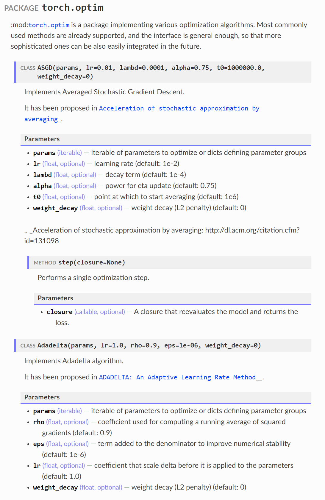

[![PyPI version][pypi-image]][pypi-link]
[![Python versions][pyversions-image]][pyversions-link]
[![Travis][travis-image]][travis-link]
[![AppVeyor][appveyor-image]][appveyor-link]
[![Coverage Status][coveralls-image]][coveralls-link]
[![Code style: black][black-image]][black-link]

# MkApi

MkApi is a [MkDocs](https://www.mkdocs.org/) plugin for auto API documentation.
MkApi supports the [Google Python Style Guide](http://google.github.io/styleguide/pyguide.html#38-comments-and-docstrings) partially.

MkApi can:

* Type annotation. If you write your function such as `def func(x: int) -> str:`, you don't need write type in `Args`, `Returns`, or `Yields` section. 
* Automatica object type detection. MkApi can create `CLASS`, `FUNCTION`, `METHOD`, or `PROPERTY` prefix for each object.

TODO:

* Hyperlink.

Install the plugin using pip:

```bash
pip install mkapi
```

Next, add the following lines to your `mkdocs.yml`:

```yml
plugins:
  - search
  - mkapi
```

(If you have no `plugins` entry in your config file yet, you'll likely also want to add the `search` plugin. MkDocs enables it by default if there is no `plugins` entry set.)

Then, in your markdown file, write a link to an package, module, or other object, just like normal Markdown:

```markdown
[mkapi](<something>)
```

For example, if you use PyTorch, you can check the functionality of MkApi:

```markdown
[mkapi](torch.optim)
```

If you run MkDocs, an API documentation is created as below:

(Off course, reStructuredText is not correctly rendered because MkApi
and MkDocs only support Markdown. This example is just a demo. Enjoy writing your docstring with Markdown.)




[pypi-image]: https://badge.fury.io/py/mkapi.svg
[pypi-link]: https://pypi.org/project/mkapi
[travis-image]: https://travis-ci.org/daizutabi/mkapi.svg?branch=master
[travis-link]: https://travis-ci.org/daizutabi/mkapi
[appveyor-image]: https://ci.appveyor.com/api/projects/status/ys2ic8n4j7r5j4bg/branch/master?svg=true
[appveyor-link]: https://ci.appveyor.com/project/daizutabi/mkapi
[coveralls-image]: https://coveralls.io/repos/github/daizutabi/mkapi/badge.svg?branch=master
[coveralls-link]: https://coveralls.io/github/daizutabi/mkapi?branch=master
[black-image]: https://img.shields.io/badge/code%20style-black-000000.svg
[black-link]: https://github.com/ambv/black
[pyversions-image]: https://img.shields.io/pypi/pyversions/mkapi.svg
[pyversions-link]: https://pypi.org/project/mkapi
